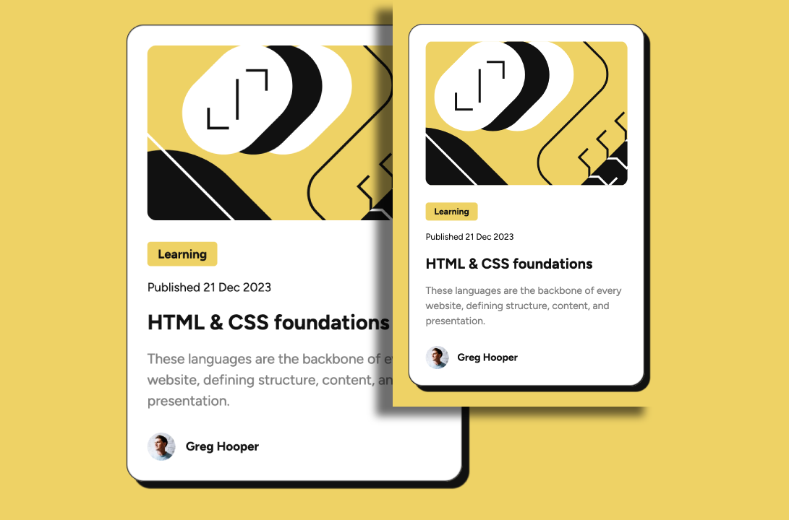

# Frontend Mentor - Blog preview card solution

This is a solution to the [Blog preview card challenge on Frontend Mentor](https://www.frontendmentor.io/challenges/blog-preview-card-ckPaj01IcS). Frontend Mentor challenges help you improve your coding skills by building realistic projects.

## Table of contents

- [Overview](#overview)
  - [The challenge](#the-challenge)
  - [Screenshot](#screenshot)
  - [Links](#links)
- [My process](#my-process)
  - [Built with](#built-with)
  - [What I learned](#what-i-learned)
  - [Continued development](#continued-development)
- [Author](#author)

## Overview

For this project, my focus will be on font sizes and accessibility. Many users may view sites at different zoom percentages within their browsers, causing fixed font sizes to behave in an unintended manner.

### The challenge

Users should be able to:

- See hover and focus states for all interactive elements on the page
- View a cohesive design regardless of font size.

### Screenshot



### Links

- Solution URL: [Frontend Mentor Solution](https://www.frontendmentor.io/solutions/blog-preview-card-focusing-on-relative-units-TnG-cKLd-G)
- Live Site URL: [Blog Preview Card](https://blogpreviewcardfem.netlify.app/)

## My process

- Reviewed design files for spacing, sizes, colors, etc.
- Set up project folder and files
- Initialized git and GitHub repo
- index.html: Wrapped content in semantic tags
- styles.css: Import fonts, set up reset and root variables
- Set class names and implement base styling
- Refactor for semantic, accessibility, and BEM compliance
- Refactor font sizes to relative units

### Built with

- Semantic HTML5 markup
- CSS custom properties
- BEM
- Flexbox
- Mobile-first workflow

### What I learned

- The 'time' tag along with the datetime attribute.

> - The <time> tag defines a specific time (or datetime).
> - The datetime attribute of this element is used translate the time into a
>   machine-readable format so that browsers can offer to add date reminders through
>   the user's calendar, and search engines can produce smarter search results.[^1]

```html
<time datetime="2023-12-21">Published 21 Dec 2023</time>
```

- I learned that there is a difference between regular (400) and medium (500) font weights. I always thought they were the same.

- I learned how to implement tooltips. When a user hovers over a link, more information about that link will appear.

```html
<a
  href="#"
  target="_blank"
  rel="noreferrer noopener"
  title="Read more about HTML & CSS foundations"
  >HTML & CSS foundations</a
>
```

- I Learned about figure and figcaption and why we would use them. In my case, it was to group the profile image and the author's name, making it clear that the two are connected with eachother.

> The <figure> HTML element represents self-contained content, potentially with an
> optional caption, which is specified using the <figcaption> element. The figure,
> its caption, and its contents are referenced as a single unit[^2].

> The <figcaption> HTML element represents a caption or legend describing the restof the
> contents of its parent <figure> element, providing the <figure> an accessible description[^3].

- Before figure and figcaption

```html
<footer class="card__footer">
  <a
    href="#"
    target="_blank"
    rel="noreferrer noopener"
    title="Read more articles by Greg Hooper"
  >
    
    <p>Greg Hooper</p>
  </a>
</footer>
```

After figure and figcaption

```html
<footer class="card__footer">
  <a
    href="#"
    target="_blank"
    rel="noreferrer noopener"
    title="Read more articles by Greg Hooper"
  >
    <figure>
      
      <figcaption>Greg Hooper</figcaption>
    </figure>
  </a>
</footer>
```

- I learned how to use the computed tab in the developer tools

[^1]: Source: [W3Schools.com](https://www.w3schools.com/tags/tag_time.asp)
[^2]: Source: [MDN Web Docs](https://developer.mozilla.org/en-US/docs/Web/HTML/Element/figure)
[^3]: Source: [MDN Web Docs](https://developer.mozilla.org/en-US/docs/Web/HTML/Element/figcaption)

### Continued development

I will continue focusing on semantic HTML, a11y, mobile-first development, and Tailwind CSS.

## Author

- Website - [Steve Xero](https://www.stevexero.com) - under construction
- Old [Website](https://www.steven-woodward.com)
- GitHub - [Steve Xero](https://www.github.com/stevexero)
- Frontend Mentor - [@stevexero](https://www.frontendmentor.io/profile/stevexero)
- X - [@steve_xero](https://www.twitter.com/steve_xero)
